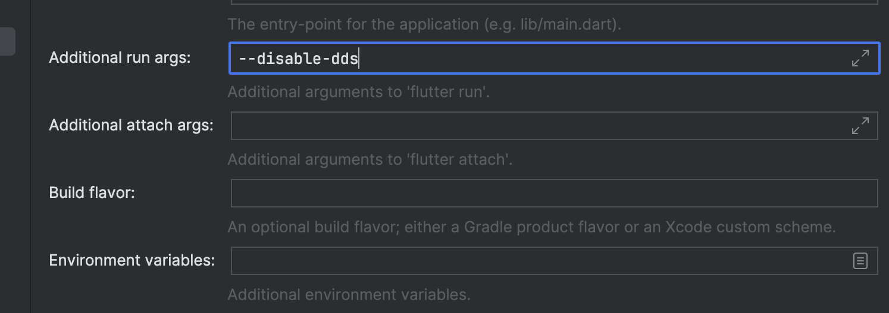
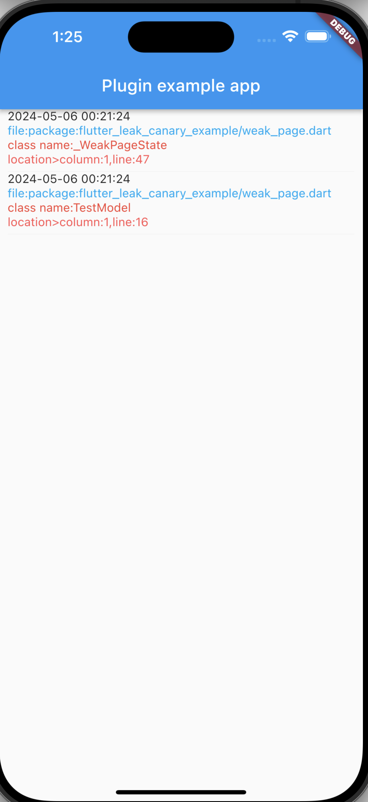

# flutter_leak_canary
This is a plugin that can detect whether a certain class has a memory leak. It is similar to Android's LeakCanary.
## step 1
It needs to be configured as VsCode or Android Studio to configure the running parameters "--disable-dds"
```
 "configurations": [
     {
         ...
         "args": [
             "--disable-dds"
         ],
         "type": "dart"
     },

 ]    
```

Or



## step 2
add **LeakCanaryStateMixin** or  **LeakCanarySimpleMixin** to detect

```dart
class _WeakPageState extends State<WeakPage> with LeakCanaryStateMixin {
 //...
}

or 

class TestModel2 with LeakCanarySimpleMixin {
  
  
  init() {
    //...
    watch();
    //...
  }

  void dispose() {
    //...
    try2Check();
    //..
  }
}


```

## example:

```dart

class WeakPage extends StatefulWidget {
  const WeakPage({super.key});

  @override
  State<WeakPage> createState() => _WeakPageState();
}

class TestModel with LeakCanarySimpleMixin {
  Timer? timer;
  int count = 0;
  init() {
    watch();
    timer = Timer.periodic(Duration(seconds: 1), (timer) {
      count++;
      print("TestModel $count");
    });
  }

  void dispose() {
    // timer?.cancel();
    try2Check();
  }
}

class TestModel2 with LeakCanarySimpleMixin {
  Timer? timer;
  int count = 0;
  init() {
    watch();
  }

  void dispose() {
    timer?.cancel();
    timer = null;
    try2Check();
  }
}

class _WeakPageState extends State<WeakPage> with LeakCanarySta
  TestModel? test = TestModel();
  TestModel2? test2 = TestModel2();
  Timer? timer;
  int count = 0;
  @override
  void initState() {
    super.initState();
    test?.init();
    test2?.init();
    timer = Timer.periodic(Duration(seconds: 1), (timer) {
      count++;
       print("_WeakPageState ${count}");
    });
  }

  @override
  void dispose() {
    // TODO: implement dispose
    super.dispose();
    //timer.cancel();
    test?.dispose();
    test2?.dispose();
    test = null;
    test2 = null;
  }

  @override
  Widget build(BuildContext context) {
    return Material(
      child: Center(
        child: Container(
          child: InkWell(
              onTap: () {
                Navigator.of(context).pop();
              },
              child: Text('back')),
        ),
      ),
    );
  }
```

